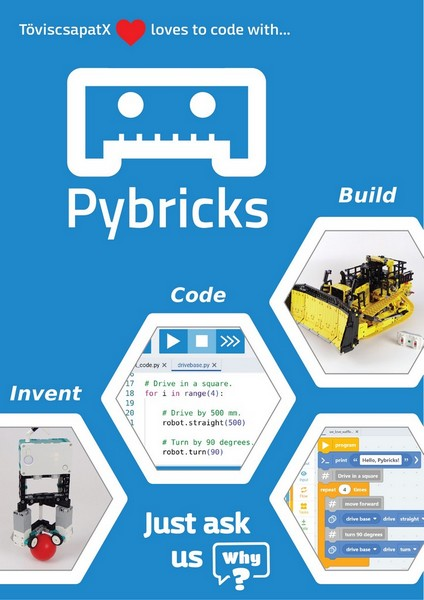

# Why Pybricks? Short review and introduction

This year of 2023-2024 our year FIRST LEGO League team, Töviscsapat-X had demonstrated a very steep learning curve on achieving reasonable and reliable robot runs taking the team from regional to national final and finally to the WPI Open invitational competition. Here the team could come to a 48th/49th place with 405 points.

The team has started programming the robot in SPIKE/Mindstorms blocky environment, yet decided to switch over to Pybricks firmware even though the text based nature of the environment gave some extra challenge.

This is a quick tutorial for FIRST LEGO League and World Robot Olympiad teams taking the next step for a reliable robot run based on 10 years of competition and judging experience.

## Team member perspective and quote
Let's start with a brief summary from Zoli Nyitrai, our robot design and documentation lead in an FLL team [Tövis Robotics Club](https://toviscsapat.hu), on his experience.

> Our team participated in the FIRST LEGO League, a LEGO robot building and programming competition. Based on our results in the national finals, we earned the opportunity to participate in an international competition held in the USA. We wrote the program to control our robot in Pybricks. We were able to learn the basics with little help in a short time since this firmware was specifically developed for controlling LEGO hubs.
> 
> It is easy to interpret and issue commands. With the use of DriveBase, the robot can be moved efficiently and quickly since you don't have to coordinate the motors yourself. Being text-based, you only need to write, and it suggests commands you can choose from, making programming very fast. Another advantage is that while programming, you can quickly and easily check what to write if you don't know it by heart.
> 
> You can easily and quickly download the program to the robot using Bluetooth, allowing you to progress rapidly with development.
> 
> -- Zoli Nyitrai

## Attila's hands-on tutorial

Let's continue with our coach's perspective - a hands-on introduction by Attila.

Pybricks can be used on both EV3 and SPIKE/Robot Inventor hardware. On the SPIKE hub, which we use and prefer, the process begins with replacing the firmware. It's not difficult, and understanding it in depth isn't necessary; all team members have learned how to use it.

in the next sections you will get a hands-on-tutorial to help you get started with Pybricks that in my experience is the best and most effective way to program your LEGO hub.

This tutorial is focusing on specific competiton aspects, while the authors of Pybricks are creating a tutorial on the site itself. I strongly recommend reading [the official tutorial](https://pybricks.com/learn) as well.

---
[NEXT: Quickstart >>](1_quickstart.md)