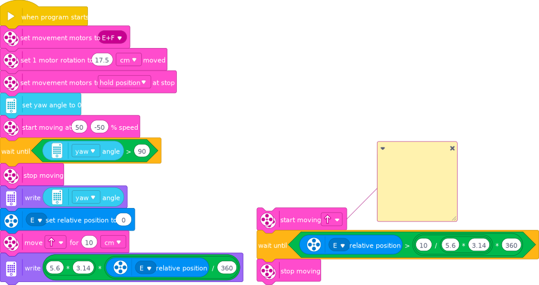

In this section, we will learn how to deal with motors.

# Controlling a motor

To control a motor we need to tell the system about the fact that we do have a motor connected to the hub.

In the template, we have already imported all that is needed to connect our motor. For completeness let's include the import statement, yet it is not needed to duplicate this line in your complete code.

```python
from pybricks.pupdevices import Motor
motor1 = Motor(Port.A)
```

In the second line we simply define the motor instance variable by calling a function like the structure we imported. Obviously, we need to state at least to which port this motor is connected to.

From this point, we can simply drive the motor by time, target angle, and relative angle.

{: .task }
> 1. Find Motor details in the Pybricks [documentation](https://docs.pybricks.com/en/latest/pupdevices/motor.html){:target="_blank"}
> 2. Connect a motor to port A
> 3. Using the above code create a motor instance
> 4. Start the motor for 3 seconds, then wait for 3 seconds
> 5. Start the motor for a complete turn, then wait for 3 seconds
> 6. Start the motor setting to the absolute position of 180 degrees, then wait for 3 seconds
> 7. Start the motor, wait for 3 seconds, then stop the motor

{: .task_solution }
> ```python
> # run the motor with a low speed for a clockwise 360-degree turn
> motor1.run_angle(100, 360)
> wait(3000)
> # run the motor with a low speed for 3 seconds
> motor1.run_time(100, 1000)
> wait(3000)
> motor1.run_target(100, 180)
> wait(3000)
> motor1.run(100)
> wait(3000)
> motor1.stop()
> ```

{:width="50%" .program_code}

# Controlling two driving motors

To control each motor individually, we inform the system that there are indeed motors involved. Here, we specify where we have connected the motor and its rotation direction.

```python
motor_left = Motor(Port.E, Direction.COUNTERCLOCKWISE)
motor_right = Motor(Port.F, Direction.CLOCKWISE)
```

This way we can start moving our robot - one motor at a time.

```python
motor_left.run_angle(100, 90)
motor_right.run_angle(100, 90)
```

# Smarter pair of motors

Two motors themselves are still "dumb" capable only of rotating for a certain time, angle, or to a target value. To make our robot more efficient, PyBricks helps us by creating a theoretical "robot" — in this case, one with two wheels, where we only need to specify their size and distance apart.

```python
# left and right motors
# using small blue diameter 5.6 cm wheels and 11.4 cm axle track
robot = DriveBase(motor_left, motor_right, 56, 114)
```

After this, navigating on the field becomes quite easy as the system calculates how much the motors need to rotate for the operations below.

{: .task }
> 1. Find the DriveBase `turn()` and `straight()` in the [documentation](https://docs.pybricks.com/en/latest/robotics.html){:target="_blank"}
> 2. Connect the two motors to E and F ports
> 3. Make the robot turn 90 degrees to the left and to the right
> 4. Make the robot move straight 10 centimeters / 100 millimeters
> 5. Combine the above to draw a rectangle

{: .task_solution }
> ```python
> motor_left = Motor(Port.E, Direction.COUNTERCLOCKWISE)
> motor_right = Motor(Port.F, Direction.CLOCKWISE)
> robot = DriveBase(motor_left, motor_right, 56, 114)
> robot.straight(100)   # move straight 100 mm
> robot.turn(90)        # turn right 90 degrees
> robot.straight(100)   # move straight 100 mm
> robot.turn(90)        # turn right 90 degrees
> robot.straight(100)   # move straight 100 mm
> robot.turn(90)        # turn right 90 degrees
> robot.straight(100)   # move straight 100 mm
> robot.turn(90)        # turn right 90 degrees
> ```

{:width="75%" .program_code}


Normally you would need to use math, and trigonometry to calculate the degree of wheel rotation for 10cm drive or using the wheel size and axle track the rotation to pivot turn 90 degrees.

Explore the functions in detail, also checking out the `curve()`, `drive()`, `stop()` functions and also printing the current values with the `distance()`, `angle()` functions.

```python
robot.curve(300, 60)    # turn in a curve 60 degrees
robot.drive(100, 0)
wait(1000)
robot.stop()

print(robot.distance())
print(robot.angle())
```

# Accuracy of the moves

What's brilliant about this is that it accelerates and decelerates for advanced reliability, measures, and corrects to ensure the motors have turned the exact amount we requested.

Of course, wheel slippage can affect accuracy. One very good and recommended option is still aligning to walls and objects.

This firmware also supports using the gyro. From here, the same instructions can be used with more precision, with corrections based on the built-in gyro sensor.

{: .task }
> 1. Set the use the gyro sensor
> 2. Make the robot turn 90 degrees to the right
> 3. Print out actual heading of the robot to the original starting position
> 4. Make the robot move straight 10 centimeters
> 5. Print out actual distance of the robot to the original starting position

{: .task_solution }
> ```python
> motor_left = Motor(Port.E, Direction.COUNTERCLOCKWISE)
> motor_right = Motor(Port.F, Direction.CLOCKWISE)
> robot = DriveBase(motor_left, motor_right, 56, 114)
> robot.use_gyro(True)
> robot.turn(90)                            # turn right 90 degrees
> print(robot.angle())                      # print the heading
> hub.display.text(str(robot.angle()))      # print to the pixel display
> robot.straight(100)                       # move 10 centimeters
> print(robot.distance())                   # print the distance travelled
> hub.display.text(str(robot.distance()))   # print to the pixel display
> ```

{:width="100%" .program_code}


---
[NEXT: Competition robot >>](3_competition.md)